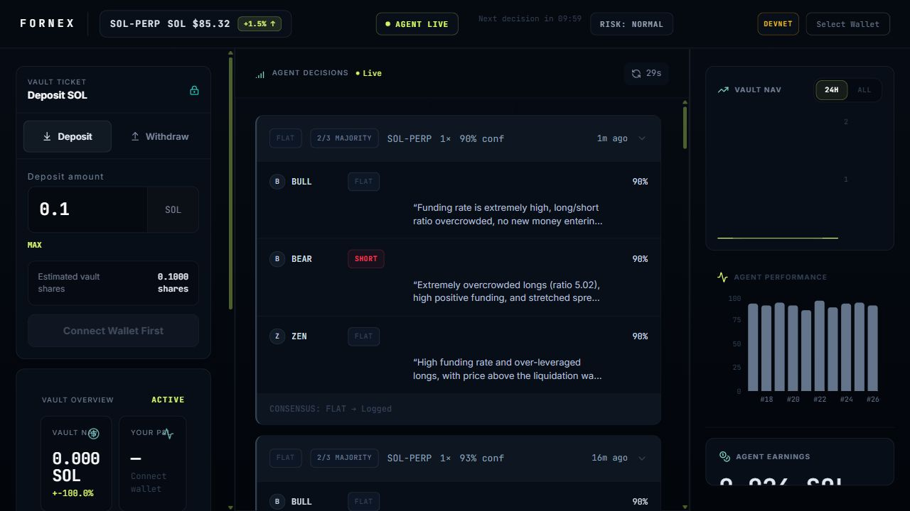
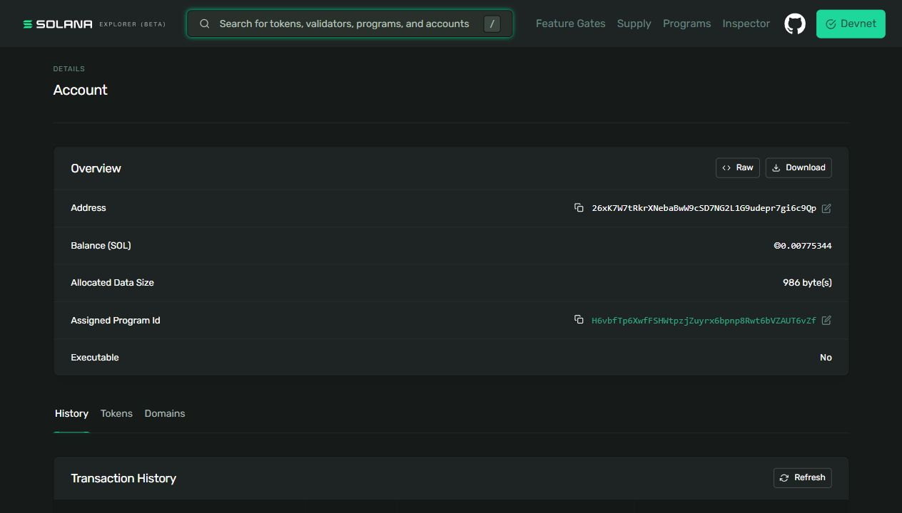
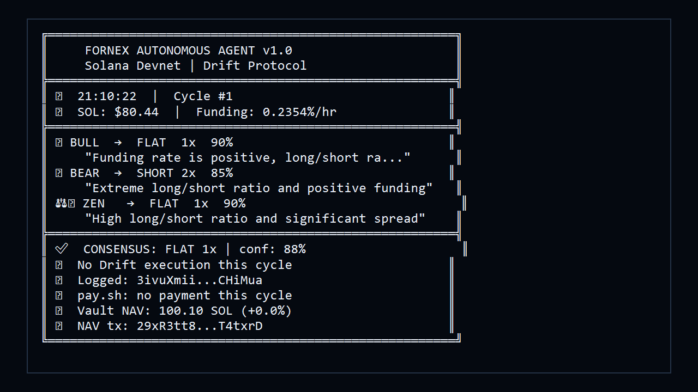
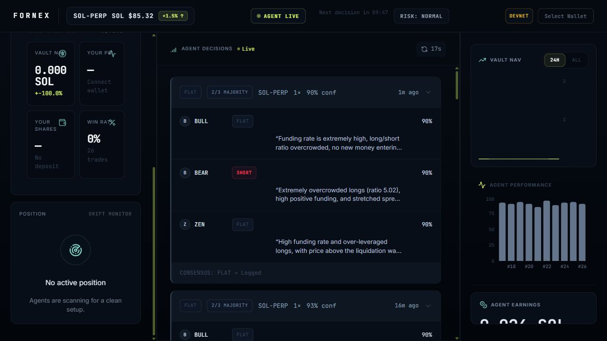

# Fornex Protocol

> Autonomous 3-agent AI trading vault where every decision
> is permanently stored on Solana. The world's first
> auditable AI hedge fund on-chain.

[]()
[]()
[]()
[]()

## 🌐 Links

| Resource | Link |
|---|---|
| Live App | https://fornexlab.vercel.app |
| Demo Video | [Recording in progress] |
| Program | https://explorer.solana.com/address/H6vbfTp6XwfFSHWtpzjZuyrx6bpnp8Rwt6bVZAUT6vZf?cluster=devnet |
| Vault PDA | https://explorer.solana.com/address/HMkL7zzAroE919esVY6HSMYzB2ejHM5m4A8JKCSrgBXR?cluster=devnet |
| $FNRX Token | https://explorer.solana.com/address/BNBf6ed4h8dZiVd8wpUkcv8BUyFsp75eidkcUhSb94vj?cluster=devnet |
| On-Chain Proof | https://fornexlab.vercel.app/proof |
| Agent Running Since | May 22, 2026 |
| On-Chain Decisions | 30+ (growing every 15 min) |

## What Makes This Technically Heavy

| Feature | Technology | Why It's Hard |
|---|---|---|
| Vault Shares | Real SPL Token ($FNRX) | Token Program CPI in Rust |
| Trade Allocation | 5% of vault NAV dynamically | On-chain math |
| Performance History | NavRecord accounts on Solana | Custom PDA indexing |
| Real-time Feed | Chain polling + SSE | Blockchain indexing |
| Trade Execution | Drift Protocol SDK | DeFi protocol integration |
| AI Agents | GPT-4o × 3 parallel | Multi-agent consensus |
| Payments | pay.sh streaming | Agentic micropayments |
| Transparency | On-chain reasoning [u8;200] | Permanent + auditable |
| Price Validation | Dynamic priority fees | RPC fee estimation |

## Technical Features

| Feature | Implementation | Depth |
|---|---|---|
| Vault Shares | Real SPL Token ($FNRX) | Token Program CPI mint/burn |
| Price Feed | Pyth Oracle on-chain | External Program CPI |
| NAV History | On-chain NavRecord accounts | Custom PDA indexing |
| Real-time Feed | Helius webhook + SSE | Blockchain indexing |
| Trade Execution | Drift Protocol SDK | Drift Protocol SDK execution |
| AI Agents | Azure GPT-4o × 3 | Multi-agent consensus |
| Payments | pay.sh streaming | Agentic micropayments |
| Transparency | On-chain reasoning | Permanent + auditable |
| Strategy Orders | Live order panel on /app | Decoded from chain |
| Live Landing Page | On-chain decisions, no wallet | getProgramAccounts |
| Status Bar | Pyth / RPC / Priority fee | Live health checks |

## Screenshots






## The Problem

Current DeFi vaults are black boxes. You deposit and hope.
No transparency into what AI is doing. No way to verify.
No auditability. Pure trust.

## The Solution

Fornex deploys three competing AI agents that debate every
perp trade on Drift Protocol. Every vote, every argument,
every disagreement — stored permanently on Solana.
Not in a database. On-chain. Forever. Verifiable by anyone.

## How It Works

```
User deposits SOL -> receives real $FNRX SPL vault shares
         |
Every 15 minutes (autonomous, no human needed):
         |
+-------------------------------------+
|  BULL 🐂  reads: funding rate, OI   |
|  BEAR 🐻  reads: L/S ratio, spread  |  -> 3 votes
|  ZEN  ⚖️   reads: liq walls, vol    |
+-------------------------------------+
         |
Majority vote -> executes on Drift Protocol
         |
ALL 3 votes + reasoning -> stored on Solana forever
         |
Agent earns 0.001 SOL via pay.sh per trade
         |
NAV updates -> share price changes -> user P&L changes
```

## The Three Agents

| Agent | Personality | Max Leverage | Signal Focus |
|---|---|---|---|
| 🐂 BULL | Momentum trader | 3x | Negative funding, rising OI |
| 🐻 BEAR | Contrarian | 2x | Extreme L/S ratio, overbought |
| ⚖️ ZEN | Risk manager | 1.5x | Liquidation walls, vol, spread |

**Consensus: 2/3 majority wins. Confidence > 65% to execute.**

## Technical Stack

| Layer | Technology |
|---|---|
| Smart Contract | Anchor (Rust) — 12 instructions |
| Perp Trading | Drift Protocol SDK (devnet) |
| AI Agents | Azure OpenAI GPT-4o |
| Agent Loop | TypeScript + pm2 (15-min cycles) |
| Payments | pay.sh streaming micropayments |
| Frontend | Next.js + pure CSS |
| Wallet | Phantom + @solana/wallet-adapter |
| Shares | SPL Token Program + Associated Token Accounts |
| Oracle | Pyth Solana Receiver |
| Indexing | Helius webhook + Server-Sent Events |

## Architecture

```
+-------------+     +------------------+     +---------------+
|    USER     |---->|  ANCHOR VAULT    |---->|  DRIFT PERPS  |
|  (Phantom)  |     |  (Solana Devnet) |     |   (devnet)    |
+-------------+     +------------------+     +---------------+
                              |
                    +---------v--------+
                    |   AI AGENT       |
                    |   (pm2, 15 min)  |
                    |                  |
                    |  signals.ts      |
                    |  brain.ts (x3)   |
                    |  executor.ts     |
                    |  logger.ts       |
                    |  paysh.ts        |
                    +---------+--------+
                              |
                    +---------v--------+
                    | MultiAgentDecision|
                    | accounts on-chain |
                    | (permanent, public)|
                    +---------+--------+
                              |
                    +---------v--------+
                    |  NEXT.JS FRONTEND |
                    |  reads chain live |
                    |  localhost:3001   |
                    +------------------+
```

## Smart Contract Instructions

| Instruction | Description |
|---|---|
| initialize_vault | Creates vault PDA, sets agent authority |
| initialize_vault_with_mint | Creates vault PDA plus $FNRX mint |
| initialize_vault_mint | One-time live-vault migration for $FNRX |
| migrate_vault_v2 | Reallocs legacy vault for NAV ledger counter |
| deposit | User sends SOL, receives proportional $FNRX |
| withdraw | Burns $FNRX, returns proportional SOL |
| log_multi_agent_decision | Stores all 3 votes plus Pyth price on-chain permanently |
| log_trade | Records individual trade execution reference |
| update_nav | Updates vault value after trade settles |
| record_nav_snapshot | Creates an immutable NavRecord PDA |
| emergency_pause | Halts agent trading (safety switch) |
| resume | Restarts agent trading after pause |

## Getting Started

```bash
# 1. Clone
git clone https://github.com/YOUR_USERNAME/fornex-protocol
cd fornex-protocol

# 2. Install dependencies
npm install
cd agent && npm install && cd ..
cd frontend && npm install && cd ..

# 3. Set up environment
cp agent/.env.example agent/.env
cp frontend/.env.local.example frontend/.env.local
# Fill in your values

# Note: anchor build requires a path without spaces on Windows.
# Clone to a path like C:\fornex or ~/fornex before running anchor build.

# 4. Run frontend
npm run dev -- -p 3001

# 5. Start agent
cd agent && pm2 start "npx ts-node src/index.ts" --name fornex-agent

# 6. View live
open http://localhost:3001
```

## Helius Webhook Setup

Configure in the [Helius dashboard](https://dev.helius.xyz/dashboard/app) to enable live blockchain event indexing:

| Setting | Value |
|---|---|
| Account Addresses | `H6vbfTp6XwfFSHWtpzjZuyrx6bpnp8Rwt6bVZAUT6vZf` |
| Transaction Types | `PROGRAM_INTERACTION` |
| Webhook Type | `enhanced` |
| Webhook URL | `https://fornexlab.vercel.app/api/webhook` |

**Step-by-step:**
1. Open Helius dashboard → Webhooks → Create Webhook
2. Set Account Address to `H6vbfTp6XwfFSHWtpzjZuyrx6bpnp8Rwt6bVZAUT6vZf`
3. Set Transaction Type to `PROGRAM_INTERACTION`
4. Set Webhook Type to `enhanced`
5. Set Webhook URL to `https://fornexlab.vercel.app/api/webhook`
6. Save the webhook
7. Trigger a new Fornex agent decision or wait for the next 15-minute cycle
8. The frontend listens to `/api/events` via SSE and shows a ⚡ **NEW DECISION** badge; 30-second polling is the fallback

> **Note:** Vercel serverless functions do not hold persistent connections.
> SSE is best-effort (works within a single cold-start window).
> The 30-second polling fallback keeps the UI current regardless.

**Local test (no Helius API key required):**
```bash
curl -X POST http://localhost:3001/api/webhook \
  -H "Content-Type: application/json" \
  -d '[{"accountData":[{"account":"H6vbfTp6XwfFSHWtpzjZuyrx6bpnp8Rwt6bVZAUT6vZf"}],"type":"PROGRAM_INTERACTION"}]'
# Expected: {"received":true,"matched":1}
```

## On-Chain Proof

Every 15 minutes, a new MultiAgentDecision account is
created on Solana. You can verify any decision at:

https://explorer.solana.com/address/26xK7W7tRkrXNebaBwW9cSD7NG2L1G9udepr7gi6c9Qp?cluster=devnet

The account stores:
- BULL vote (direction + leverage + confidence + reasoning)
- BEAR vote (direction + leverage + confidence + reasoning)
- ZEN vote (direction + leverage + confidence + reasoning)
- Consensus decision
- Pyth-verified SOL price and confidence
- Execution status
- Timestamp

NAV history is also stored as standalone NavRecord PDA accounts, so the
performance chart can be rebuilt directly from Solana account history.

**This data is permanent. Immutable. Trustless.**

## Demo Proof Transactions

| Action | Transaction |
|---|---|
| Deposit 0.5 SOL | https://solscan.io/tx/4AQNwfbUs1Z3cbo7VLreCeLgrrh1r7PnCzoKQzYQoL97JgQiQw4TWeiHpJsjvy6roAwq9F4BSqdukfsEcBsZRvRj?cluster=devnet |
| Withdraw SOL | https://solscan.io/tx/4bfNiVKpZFKAzYvNmkUbbF2xzPGQKsq8faUqsKMFjbz6VzN2ef1qNFWMZahP3ScHQ7sropae9DfLcj5khVcbtwR1?cluster=devnet |

## Known Limitations (Devnet Prototype)

- Agent executes trades via its own wallet, not vault CPI
- NAV updates are calculated off-chain by the agent
- Not audited — devnet only, no real funds
- emergency_pause covers trading and NAV updates, not deposits/withdrawals
- Live decision feed depends on devnet RPC availability

---

## Disclaimer

This is a **Solana devnet hackathon prototype**. It is not audited, not deployed
on mainnet, and not intended for real user funds. All transactions use devnet SOL
with no real monetary value.

---

Built for Solana India Cohort Capstone — May 2026
